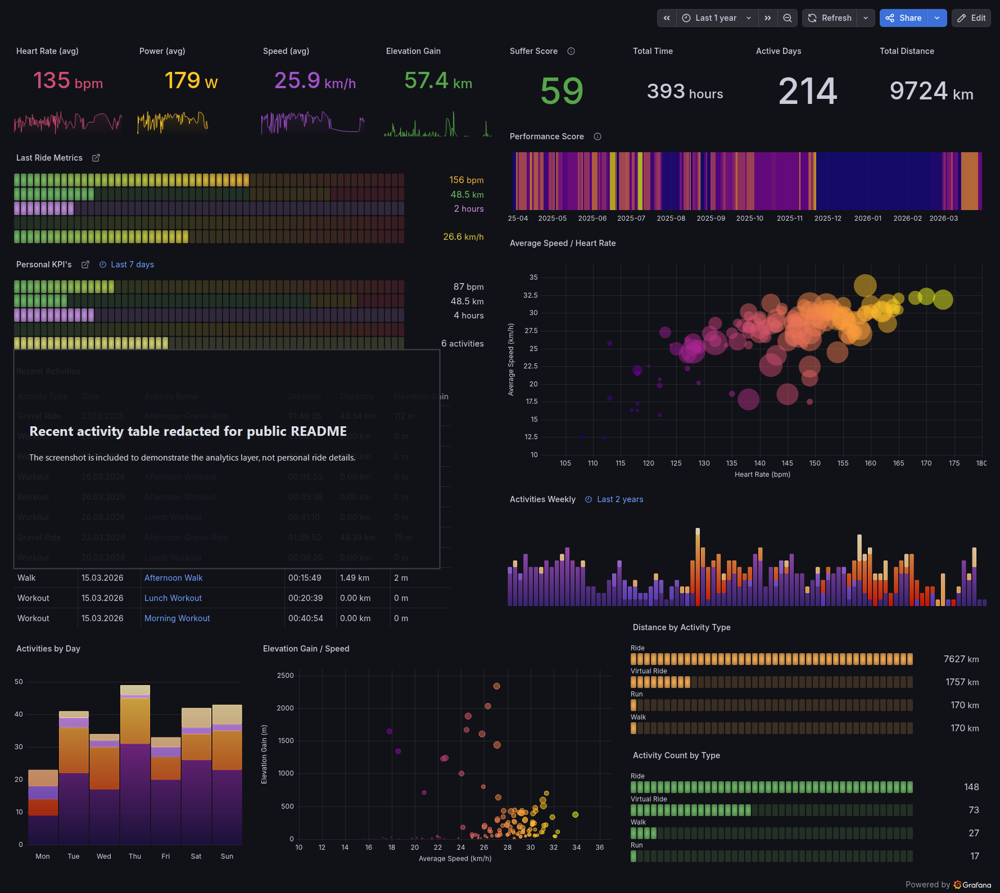

# Strava Pipeline

Event-driven sports analytics pipeline on AWS. The project ingests Strava activity events via webhooks, lands raw and curated data in S3 and Athena, and powers a Grafana dashboard for reporting and trend analysis.

## Overview

- Built as an end-to-end analytics system: API ingestion, cloud storage, transformation, SQL materialization, and BI consumption.
- Uses Strava webhooks instead of constant polling, reducing unnecessary API traffic while keeping ingestion near real time.
- Provisions infrastructure with Terraform, keeping runtime configuration aligned with the deployed AWS stack.
- Organizes data into raw, staging, and analytics/main layers (`raw/`, `staging/`, `main/`) to separate source fidelity from query-ready models.
- Materializes curated activity data in Athena and exposes it to Grafana for dashboards and exploratory analysis.
- Demonstrates hands-on ownership across Python, AWS, Terraform, SQL, and analytics delivery.

## Architecture

`Strava -> Webhook -> ECS Worker -> S3 raw/staging -> Athena -> Grafana`

The primary flow is webhook-driven. An optional EventBridge Scheduler can trigger the same worker as a safety net for missed events or backfills, but polling is not the main design.

### Runtime Modes

| Mode | Entry Command | Responsibility |
|------|---------------|----------------|
| `webhook` | `python -m app.main webhook` | Public ingress, webhook verification, request validation, and ECS worker trigger |
| `worker` | `python -m app.main worker` | Fetch from Strava, filter new activities, write raw/staging data, update checkpoint state, run Athena SQL |
| `create_sub` | `python -m app.main create_sub` | One-time task for creating or recreating the Strava push subscription |

## Stack

- Python 3.11, Flask, Boto3
- AWS ECS Fargate, ALB, S3, Secrets Manager, Athena, Glue, ECR
- Terraform for infrastructure provisioning
- Grafana querying Athena as the final visualization layer

## Analytics Output

The dashboard is included as proof that the pipeline ends in an analytics-ready consumption layer, not just raw JSON landing. The recent activity table is redacted for public sharing; the goal here is to show the data product, not personal ride details.

The screenshot demonstrates that the curated Athena layer supports:

- KPI rollups such as distance, time, active days, heart rate, power, and elevation
- recent activity monitoring and freshness checks
- weekly and yearly trend analysis
- scatter plots such as speed vs heart rate and elevation vs speed
- segmentation by activity type across the same modeled dataset

## Key Engineering Decisions

- Webhook-first ingestion: Strava pushes activity events into the system, avoiding wasteful polling as the primary path.
- Decoupled trigger and worker: the public webhook validates requests and launches an ECS task, while the worker owns fetching, filtering, storage, and SQL execution.
- Incremental processing with checkpoint state: the worker stores the last processed position in S3 so runs stay resumable and deterministic.
- Layered storage and modeling: raw payloads are preserved, transformed records are written to staging, and SQL materializes a curated analytics table in Athena.
- Terraform-first deployment: infrastructure code provisions the AWS resources and injects the runtime contract the application expects.

## Repository Docs

- [SETUP.md](SETUP.md) covers deployment, secrets, runtime configuration, and local development.
- [infra/terraform/README.md](infra/terraform/README.md) documents the AWS stack and Terraform inputs and outputs.
- [scheme.txt](scheme.txt) provides a concise repository and architecture map.

## Current Scope

This repository is meant to show a working cloud analytics pipeline rather than a fully packaged product. The main next-step areas are:

- advanced retry, backoff, and dead-letter handling
- richer monitoring and alerting beyond logs and dashboarding
